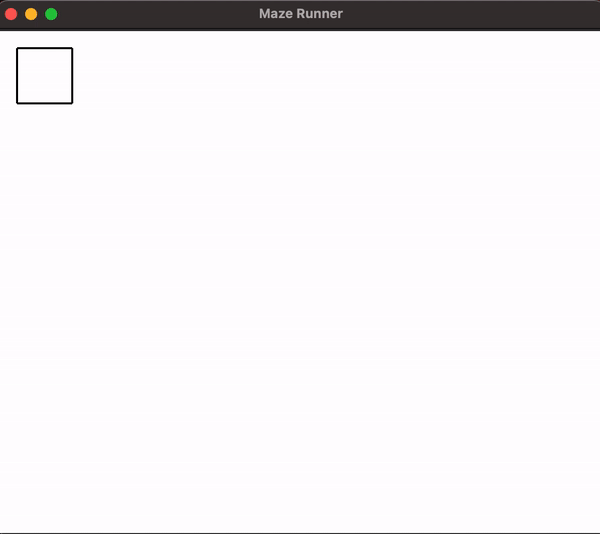

<h1 align="center">Maze Runner - Maze Generator & Solver using breadth-first search</h1>
<p>
</p>

> Maze Runner is project to visually show how a [breadth-first search algorithm](https://en.wikipedia.org/wiki/Breadth-first_search) works.

## Usage
To run this project simple run the following command in the root of the directory

```sh
python3 main.py
```

## Demo



## Author

👤 **Ty Facey**

* Website: https://ty-personal-portfolio.vercel.app/
* Github: [@faceyacc](https://github.com/faceyacc)
* LinkedIn: [@https:\/\/www.linkedin.com\/in\/ty-facey\/](https://linkedin.com/in/https:\/\/www.linkedin.com\/in\/ty-facey\/)

## Show your support

Give a ⭐️ if this project helped you!

***
_This README was generated with ❤️ by [readme-md-generator](https://github.com/kefranabg/readme-md-generator)_
